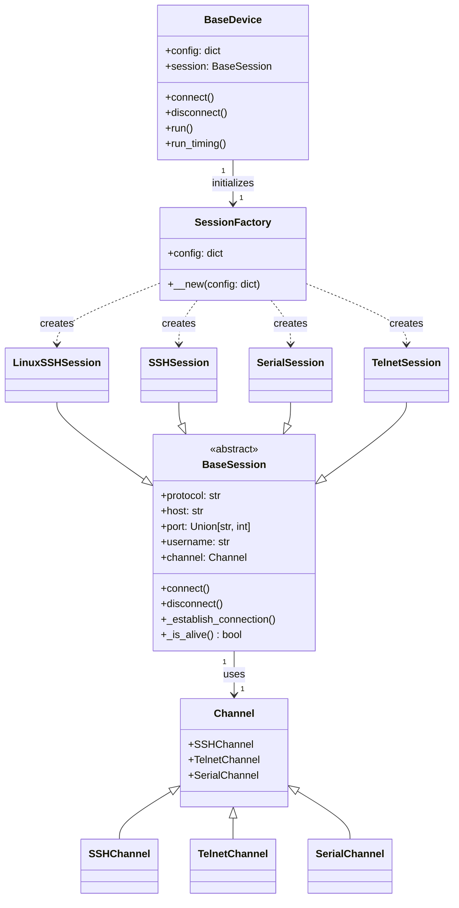

## Architecture Overview
This document provides an overview of the architecture designed for managing network device sessions in an automation framework. The architecture leverages a combination of abstract and concrete classes to facilitate flexible, protocol-agnostic interactions with various types of network devices, including those that require SSH, Telnet, or Serial connections.

## Core Components
The architecture is built around the following core components:

- **Channel Classes**: Abstract representations of communication channels that define a unified interface for interacting with network devices. These channels are specialized into `SSHChannel`, `TelnetChannel`, and `SerialChannel` to handle specific protocol requirements.

- **BaseSession Class**: An abstract class that outlines the basic structure and functionalities required for a session with a network device. It defines methods for connecting to, disconnecting from, and checking the status of the device, as well as abstract methods that must be implemented by subclasses for specific session handling.

- **SessionFactory**: A factory class responsible for dynamically creating session instances based on the provided configuration. This configuration specifies the protocol and device type, which the factory uses to instantiate the appropriate session class.

- **BaseDevice Class**: Represents a network device and manages its session. It is initialized with a configuration dictionary and uses the `SessionFactory` to create a session instance tailored to the device's requirements. The `BaseDevice` class provides methods for connecting to and disconnecting from the device, as well as for executing commands either synchronously or with timing control.

## Session Creation Process
The session creation process is central to the architecture's flexibility and extensibility. Upon initialization, the `BaseDevice` class receives a configuration dictionary specifying details such as the device's protocol and type. It then passes this configuration to the `SessionFactory`, which uses a matching process to determine the appropriate session class to instantiate. For example:

If the configuration specifies an SSH protocol and the device type is Linux, a `LinuxSSHSession` is instantiated.
For other devices requiring SSH, a general `SSHSession` is created.
Serial and Telnet connections result in the instantiation of `SerialSession` and `TelnetSession`, respectively.

## Conclusion
This architecture provides a robust framework for network automation by abstracting the complexities of session management and device communication. Through its use of the factory pattern for session instantiation, the architecture allows for easy extension to support additional device types and communication protocols, making it a versatile solution for a wide range of network automation tasks.